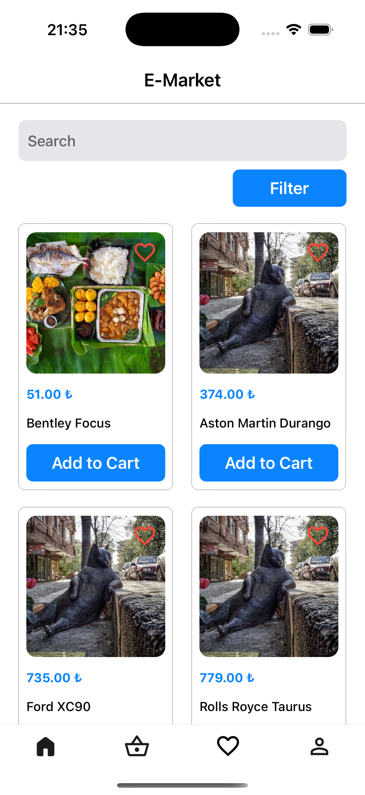
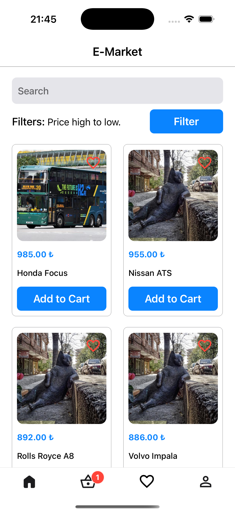
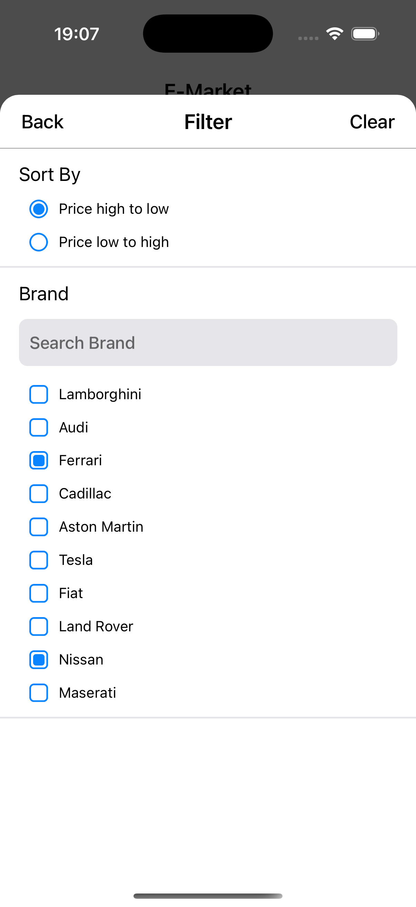
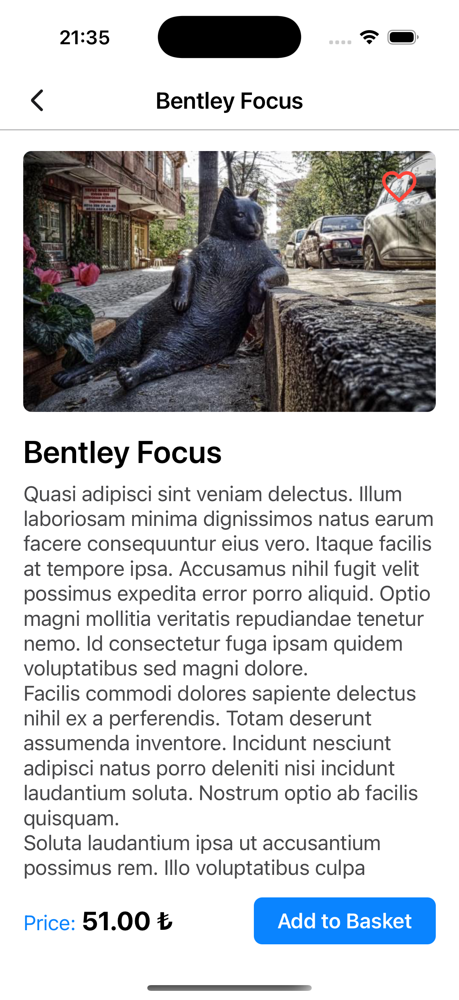
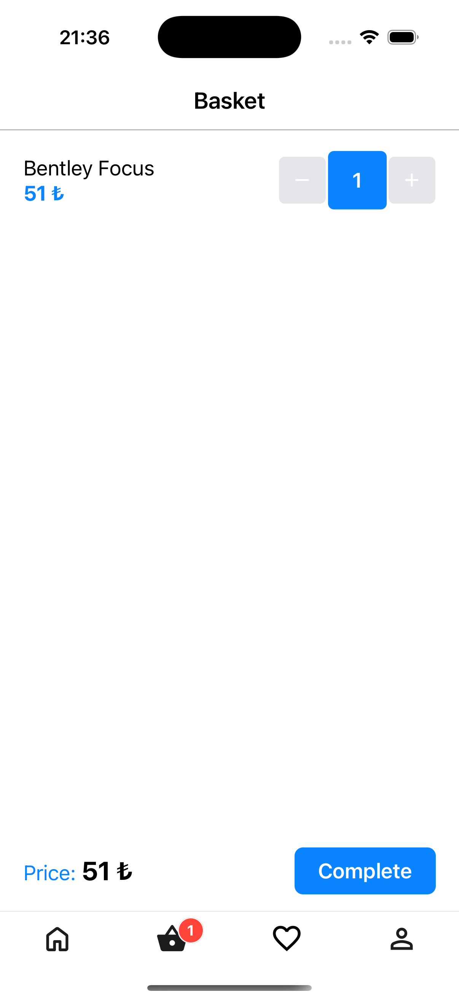
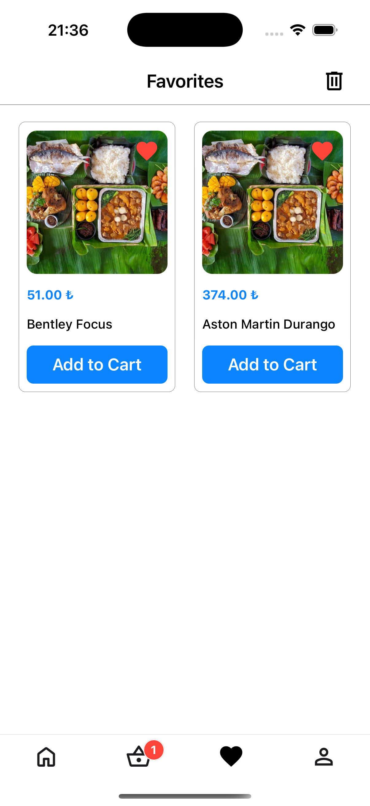

# Eteration Case Study

<details close>
  <summary>Uygulamaya ait ekran görüntülerini görmek için tıklayın.</summary>
        
</details>

## Teknoloji

- React Native

## Tools

- React Navigation
- React Native Modal
- Redux Toolkit
- MMKV
- Jest
- Redux Mock Store

## Özellikler

- Ürünlerin listelenmesi ve detayının gösterilmesi.
- Listelenecek ürünlere filtreler ekleyebilmek.
- Ürünleri sepete ekleyebilmek.
- Ürünüleri favorilere ekleyebilmek.

## Kurulum

Bu depoyu yerel makinenizde klonlayın.

```
git clone https://github.com/ibrahimaykutbas/eteration-case-study.git
```

### Hazırlık

Projeyi klonladıktan sonra ilgili dizine gidin.

```
cd eteration-case-study
code .
```

Proje bağımlılıklarını yüklemek için proje dizininde aşağıdaki komutları çalıştırın.

```
npm install
-veya-
yarn
```

Eğer macOS kullanıyorsanız ve iOS işletim sistemine sahip bir cihazda projeyi başlatacaksanız pod'ları yükleyin.

```
cd ios
pod install
```

### Kullanım

Projeyi başlatmak için aşağıdaki komutları kullanın.

```
npm run android
-veya-
npm run ios
```

Unit testleri çalıştırmak için aşağıdaki komutları kullanın.

```
npm run test
-veya-
yarn test
```

Bu talimatlar, geliştirme ve test amacıyla yerel makinenizde projenin bir kopyasını hazır ve çalışır hale getirecektir.

## Daha Fazla Bilgi İçin

Daha fazlasını şuradan öğrenebilirsiniz: [React documentation](https://reactnative.dev/)
